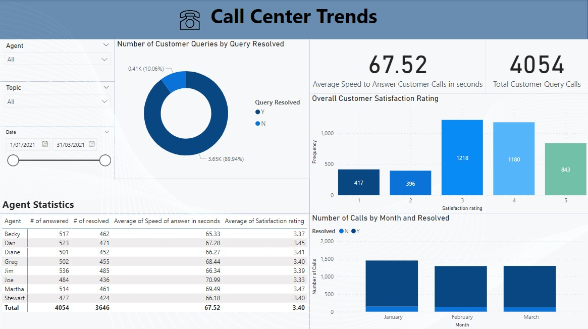

## Call Center Trend Statistics

The telecom industry is highly competitive, with numerous players vying for market share. So Call Centre Managers look for transparency and insights into their center's data to understand and improve Key Performance Indicators (KPIs).

So in this project, I am visualising call center's data to provide an accurate overview of long-term statistics and trends in customer and agent behaviour.
The dashboard reflects relevant Key Performance Indicators (KPIs) and metrics such as - 
- Overall customer satisfaction
- Overall calls answered/abandoned
- Calls by time
- Average speed of answer
 - Agent statistics
 
 Dashboard:
 
 
