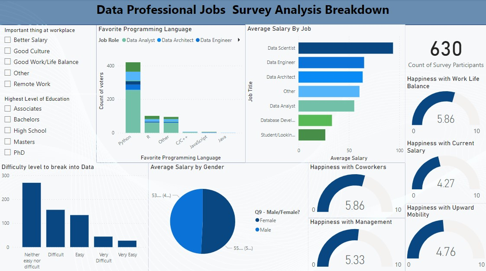

## Data Job Satisfaction Survey Analysis

In this project, I have analysed a Data job satisfaction survey. The project analysis survey results from the feedback from individuals who work in data-related roles, such as data scientists, data analysts, and data engineers, to assess their overall job satisfaction levels and identify factors that contribute to or detract from their job satisfaction. 

Analyzing the results of surveys will provide valuable insights to organizations about the experiences and perceptions of their data workforce, job satisfaction and help inform decision-making and strategies related to talent.

