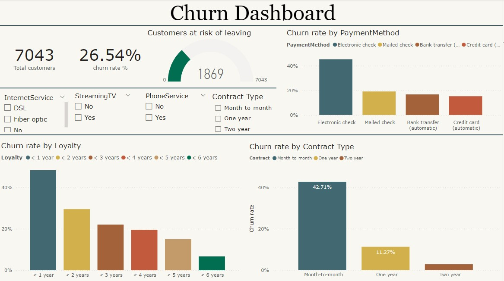

## Telecom Customer Churn Analysis

Customer retention is a critical factor in the telecommunications industry, as it directly impacts the revenue and profitability of telecom service providers. Telecom companies face significant competition, and retaining customers is more cost-effective than acquiring new ones. 

Hence in this project, I will analyse how likely customers will stop there service from their service provider. The project aims to understand the factors that contribute to customers leaving a telecom service provider and identify patterns, trends, and potential predictors of churn. By conducting churn analysis, telecom companies can gain insights into customer behavior, identify areas for improvement, and develop strategies to reduce customer churn and improve customer retention.

